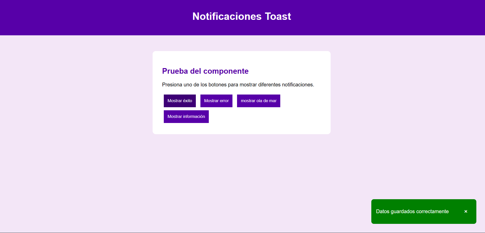
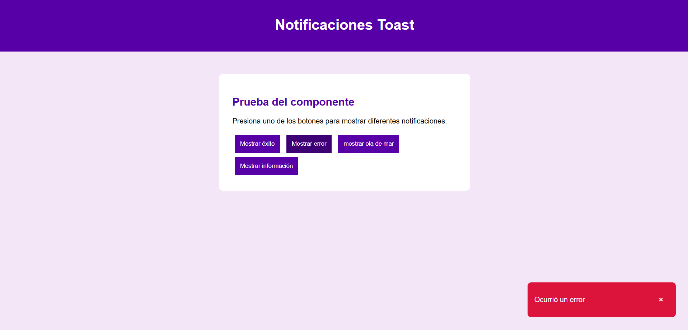
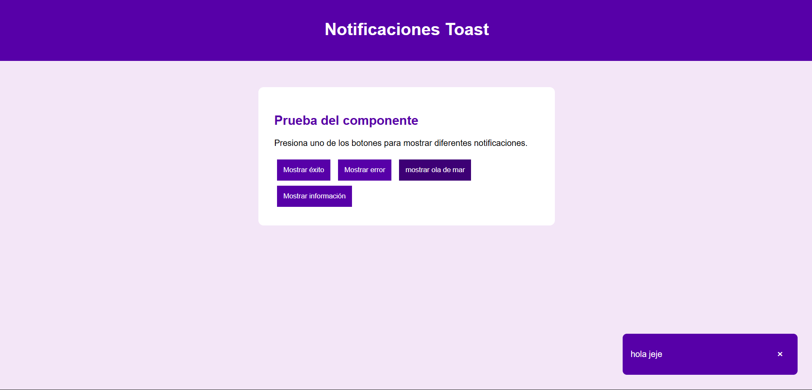

# Componente Toast

## Portada

Nombre: Componente visual reutilizable tipo Toast con JavaScript

## ¿Qué problema resuelve?

Este componente permite mostrar notificaciones visuales dentro de una página web sin tener que crear una estructura diferente cada vez.

Puede utilizarse para mostrar mensajes de éxito, error o información.

La finalidad es reutilizar el mismo componente cambiando únicamente el mensaje y el tipo de notificación.

---

# Instalación

Para utilizar el componente se deben agregar los archivos CSS y JavaScript al documento HTML.

CSS:

```html
<link rel="stylesheet" href="css/componente.css">
```

JavaScript:

```html
<script src="js/componente.js"></script>
```

Después de incluir ambos archivos, el componente puede utilizarse desde JavaScript.

---

# Ejemplo de uso

La función principal es:

```javascript
mostrarToast(mensaje, tipo);
```

Recibe dos parámetros:

- `mensaje`: texto que se mostrará en la notificación.
- `tipo`: determina el estilo de la notificación.

Ejemplo de éxito:

```javascript
mostrarToast("Datos guardados correctamente", "exito");
```

Ejemplo de error:

```javascript
mostrarToast("Ocurrió un error", "error");
```

Ejemplo informativo:

```javascript
mostrarToast("Tienes una nueva notificación", "info");
```

---

# Reutilización

El componente puede utilizarse varias veces sin modificar su código.

Por ejemplo:

```javascript
mostrarToast("Usuario registrado", "exito");

mostrarToast("Contraseña incorrecta", "error");

mostrarToast("Sesión por terminar", "info");
```

En los tres casos se utiliza la misma función, pero cambia el contenido y el tipo de notificación.

---

# Funcionamiento

El componente crea una notificación visual mediante JavaScript.

La notificación:

- Muestra un mensaje en pantalla.
- Cambia de apariencia dependiendo del tipo.
- Puede cerrarse mediante un botón.
- Desaparece automáticamente después de unos segundos.

---

# Estructura del proyecto

```text
actividad/
│
├── README.md
├── index.html
│
├── css/
│   └── componente.css
│
├── js/
│   └── componente.js
│
└── img/
```

---

# Capturas de pantalla

Aquí se agregarán capturas del componente funcionando.

## Toast de éxito



## Toast de error



## Toast informativo



---

# Video demostrativo

jejeje

---
